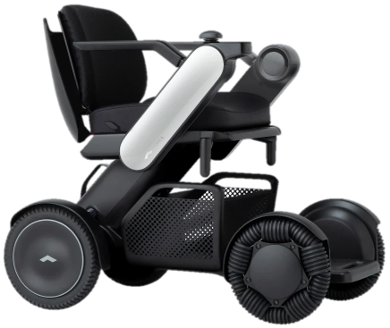
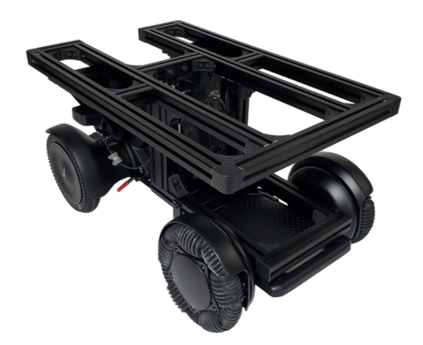
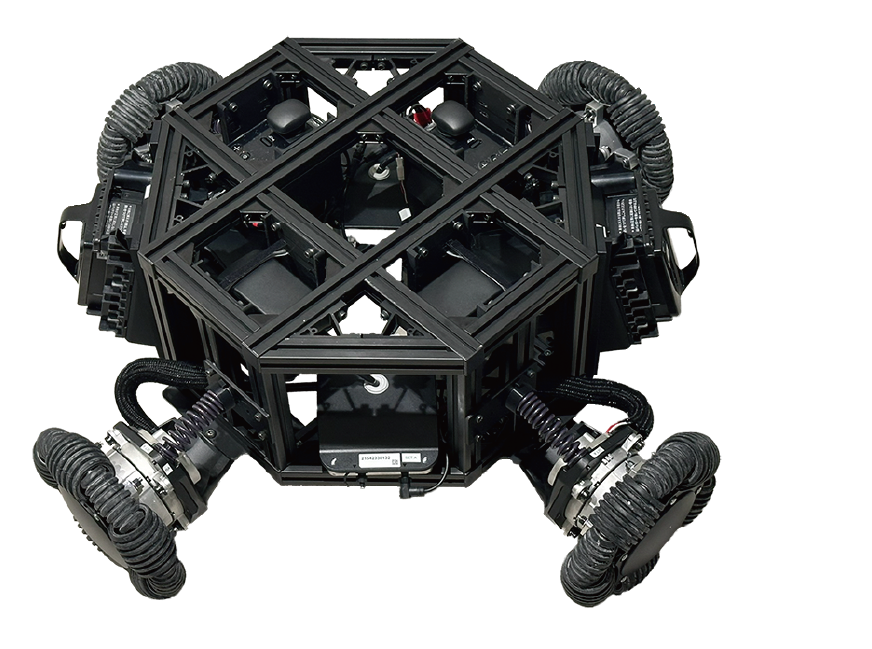

  

<h1 align="center">
  WHILL Mobile Robot Platform テクニカルサポート
</h1>

  <a href="README.en.md">English</a> · <b>日本語</b>

  WHILL 株式会社が提供する <b>WHILL Mobile Robot Platform（MRP）</b> のテクニカルサポート窓口です。

  <a href="docs/troubleshooting/power.md"><b>電源が入らない</b></a> ·
  <a href="https://github.com/WHILL/mrp-support/issues/new/choose"><b>質問する</b></a> ·
  <a href="https://whill-mrp.notion.site/WHILL-f975baf4015e4eebbb243a7d331efb0a"><b>製品ページ</b></a>

  
  
  

---

> [!TIP]
> **電源が入らない場合は、まずこちら → [電源が入らない（確認フローチャート）](docs/troubleshooting/power.md)**

MRP に関する技術的なご質問は、このリポジトリの [Issues](https://github.com/WHILL/mrp-support/issues) で受け付けています。

修理や部品購入はテクニカルサポートの対象外です。**mrp.contact@whill.inc** へご連絡ください。

## よくあるお問い合わせ

お問い合わせの多い事象について、確認手順をフローチャートにまとめています。Issue を起票する前に
一度お試しください。

| 事象 | |
|---|---|
| **電源が入らない**（電源ボタン／シリアル通信とも） | [確認手順](docs/troubleshooting/power.md) |
| **充電ランプが点灯しない・赤点滅が続く** | [確認手順](docs/troubleshooting/power.md) |
| **バッテリー LED が青点滅する** | [確認手順](docs/troubleshooting/power.md) |

通信の不具合は、まず [WHILL Serial API Tester](https://whill.github.io/whill-serial-api/cr2/tester/)
をお試しいただくのが近道です。Chrome / Edge から WHILL と直接通信するため、原因が WHILL 側か、
お客様のプログラム側かをすぐ確認できます。

## WHILL Serial API

MRP のシリアル通信インターフェースです。仕様書と、ブラウザで動作するテスターを公開しています。

### → **[https://whill.github.io/whill-serial-api/](https://whill.github.io/whill-serial-api/)**

| 製品 | 仕様書 | テスター |
|---|---|---|
| [**Model CR2**](https://whill.inc/jp/model-cr2) ロボット台車 電装系キット | [cr2/spec/](https://whill.github.io/whill-serial-api/cr2/spec/) | [cr2/tester/](https://whill.github.io/whill-serial-api/cr2/tester/) |
| **オムニプラットフォーム** | [omni/spec/](https://whill.github.io/whill-serial-api/omni/spec/) | [omni/tester/](https://whill.github.io/whill-serial-api/omni/tester/) |

テスターは **Chrome または Edge** が必要です。ダウンロードすればオフラインでも動作し、通信はブラウザと
WHILL の間のみで行われます。

## ライブラリ

| 言語 | ライブラリ | 状態 |
|---|---|---|
| ROS 2 (Humble) | [ros2_whill](https://github.com/whill-labs/ros2_whill) | サポート中 |
| Python | [pywhill](https://github.com/WHILL/pywhill) | サポート中 |
| Arduino | [whill-sdk-arduino](https://github.com/WHILL/whill-sdk-arduino) | サポート中 |

## サポート終了

以下はサポートを終了しています。稼働中の機体・環境があるため、参照用に記載しています。

| 項目 | 備考 |
|---|---|
| **WHILL Model CR** | サポートを終了しました。後継は Model CR2 です。 |
| [ros_whill](https://github.com/WHILL/ros_whill)（ROS 1 Melodic） | ROS 1 が EOL のため。[ros2_whill](https://github.com/whill-labs/ros2_whill) をご利用ください。 |
| [whill_control_system_protocol_specification](https://github.com/WHILL/whill_control_system_protocol_specification) | [WHILL Serial API](https://whill.github.io/whill-serial-api/) に移行しました。PDF は Model CR 向けで、更新していません。 |
