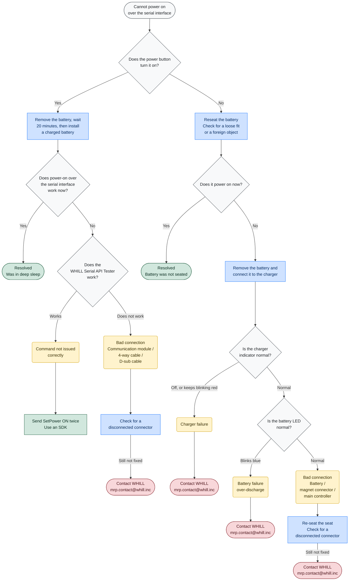
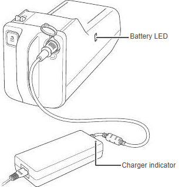

# Cannot power on

**English** · [日本語](power.md)

A decision flowchart for the most frequent enquiry we receive: the WHILL does not power on over the
serial interface. Please work through it before opening an issue.

Applies to Model CR2, Wheeled Robot Base, Electrical System Kit and Omni Platform.

## Flowchart

**How to read this chart** — ◇ check　／　<b>blue</b> do this　／　<b>yellow</b> cause　／　<b>green</b> resolved　／　<b>red</b> contact WHILL

> **About deep sleep**
> Units shipped in certain periods enter deep sleep once the battery level reaches 19% or below.
> Such a unit does not answer on the serial interface and does not recover until the battery has
> been removed long enough to discharge it. The power button still turns the unit on, so the fault
> shows up as communication alone failing. It is most often seen on units left unused for a long time.

> **About the WHILL Serial API Tester**
> Model CR2 / Wheeled Robot Base / Electrical System Kit — https://whill.github.io/whill-serial-api/cr2/tester/
> Omni Platform — https://whill.github.io/whill-serial-api/omni/tester/
>
> It talks to the WHILL directly from Chrome or Edge. No installation and no driver, and it tells
> you at once whether the problem is in the WHILL or in your own program.

## Indicator locations

The **battery LED** is on the battery itself; the **charger indicator** is on the charger.

## Charger indicator

The lamp on the **charger**.

| Indication | Meaning |
|---|---|
| Blinking green | Charging |
| Solid green | Charge complete |
| Solid red | Standby — plugged into the wall outlet but not connected to the battery |
| Blinking red | Charge error |
| Off | No power reaching the charger |

> **Blinking red**
> The battery is not connected properly. Reconnect it. If it still blinks red, unplug the charger
> from the wall outlet, wait until the indicator goes out, then plug it in again. If several attempts do
> not clear it, the battery or the charger has failed.

> **Turns solid green immediately**
> If the indicator goes solid green while the battery is not fully charged, a different charger may
> be in use.

## Battery LED

The LED on the **battery**. Its colour shows the remaining charge.

| Colour | Remaining charge |
|---|---|
| Green | Full |
| Orange | About 30% to just under full |
| Red | Under about 30% |
| Purple | Empty |

**Abnormal indication**

| Indication | Meaning |
|---|---|
| Blinking blue | Battery failure, over-discharge. This is not a charge-level indication. |

> The battery LED goes out a while after charging completes. An LED that is off is not by itself a
> fault.

## Still not resolved

| Topic | Where |
|---|---|
| Serial communication, the specification, libraries | [Issues](https://github.com/WHILL/mrp-support/issues) |
| Repairs, replacement parts | mrp.contact@whill.inc |
