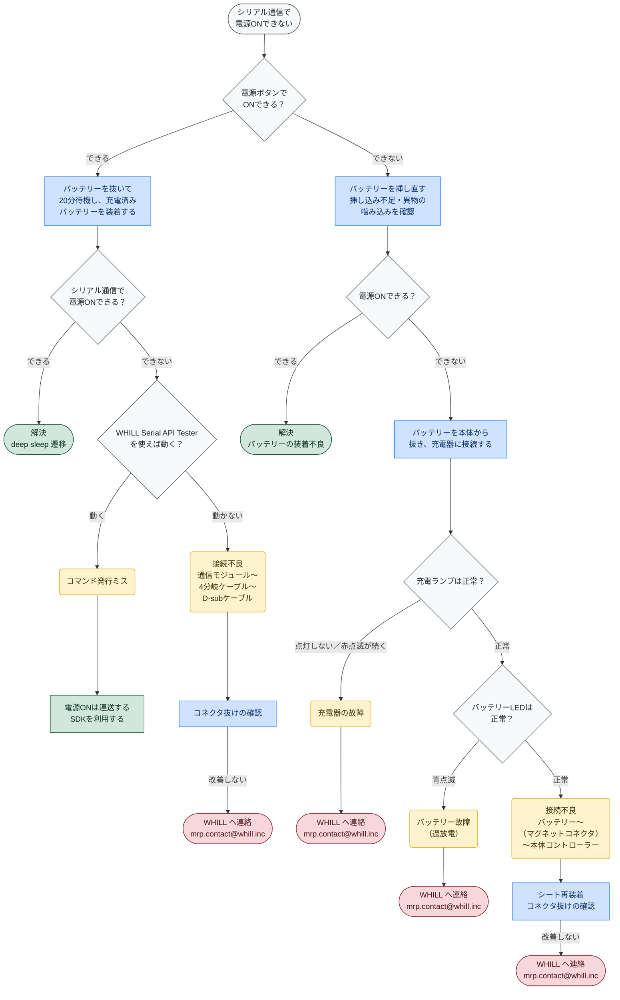
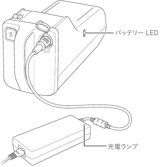

# 電源が入らない

[English](power.en.md) · **日本語**

最も多いお問い合わせである「シリアル通信で電源が入らない」場合の確認手順です。
Issue を起票する前に、一度お試しください。

Model CR2、ロボット台車、電装系キット、オムニプラットフォームが対象です。

## フローチャート

**図の見方** — ◇ 確認すること　／　<b>青</b> 操作　／　<b>黄</b> 原因　／　<b>緑</b> 解決　／　<b>赤</b> WHILL へ連絡

> **deep sleep について**
> 一部の出荷分は、バッテリー残量が 19% 以下になると deep sleep に移行します。この状態の機体は
> シリアル通信に応答せず、バッテリーを取り外して放電させない限り復帰しません。本体の電源ボタンでは
> 起動するため、通信だけができない状態として現れます。長期間使用していなかった機体で起きやすい状態です。

> **WHILL Serial API Tester について**
> Model CR2 / ロボット台車 / 電装系キット — https://whill.github.io/whill-serial-api/cr2/tester/
> オムニプラットフォーム — https://whill.github.io/whill-serial-api/omni/tester/
>
> Chrome / Edge から WHILL と直接通信するツールです。インストールもドライバも不要で、
> 原因が WHILL 側か、お客様のプログラム側かをすぐ確認できます。

## ランプの位置

**バッテリー LED** はバッテリー本体に、**充電ランプ** は充電器にあります。

## 充電ランプ

**充電器**側のランプです。

| 表示 | 意味 |
|---|---|
| 緑点滅 | 充電中 |
| 緑点灯 | 充電完了 |
| 赤点灯 | スタンバイ状態（コンセントに接続、バッテリー未接続） |
| 赤点滅 | 充電エラー |
| 消灯 | 充電器に電源が来ていない |

> **赤点滅する場合**
> きちんと接続されていません。接続し直してください。それでも赤点滅する場合は、壁面コンセントから
> プラグを抜き、充電ランプが消灯してから再度接続してください。数回試しても解消しない場合は、
> バッテリーまたは充電器の故障が考えられます。

> **すぐに緑点灯する場合**
> バッテリーが満充電ではない状態で充電ランプがすぐに緑点灯する場合、別の充電器を使用している
> 可能性があります。

## バッテリー LED

**バッテリー**側の LED です。色が残量を示します。

| 色 | 残量 |
|---|---|
| 緑色 | 満充電 |
| オレンジ色 | 約30%〜満充電未満 |
| 赤色 | 約30%未満 |
| 紫色 | 残量なし |

**異常表示**

| 表示 | 意味 |
|---|---|
| 青点滅 | バッテリー故障（過放電）。残量表示ではありません。 |

> バッテリー LED は充電完了後、一定時間が経過すると消灯します。消灯しているだけでは異常では
> ありません。

## それでも解決しない場合

| 内容 | 窓口 |
|---|---|
| シリアル通信・仕様・ライブラリ | [Issues](https://github.com/WHILL/mrp-support/issues) |
| 修理・部品購入 | mrp.contact@whill.inc |
